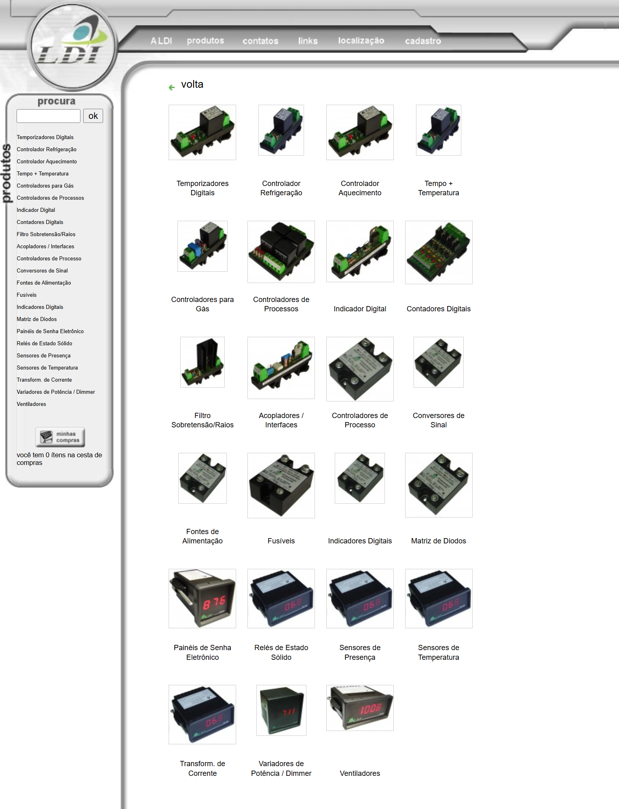

<!-- BACK TO TOP ANCHOR -->

<!-- LOGO -->

  

  <h1 align="center">LDI Eletrônica Industrial</h1>

  
A PHP/MySQL e-commerce and product catalog platform for an industrial electronics distributor, featuring a 20-category browsable catalog, customer registration and inquiry cart, and a custom CMS admin panel.

  
// industrial automation · LDI Eletrônica · custom CMS

   

  <a href="https://leonardo-vasconcellos.vercel.app/portfolio/ldi"
    ><strong>View it live »</strong></a>

 

<!-- SHIELDS -->

[![Creator Website][website-shield]][website-url]
[![Contributors][contributors-shield]][contributors-url]
[![Forks][forks-shield]][forks-url]
[![Issues][issues-shield]][issues-url]
[![LinkedIn][linkedin-shield]][linkedin-url]
[![Released][year-shield]][year-url]

<!-- TABLE OF CONTENTS -->

  
Table of Contents

  <ol>
    <li><a href="#about-the-project">About The Project</a></li>
    <li><a href="#screenshots">Screenshots</a></li>
    <li><a href="#built-with">Built With</a></li>
    <li><a href="#roadmap">Roadmap</a></li>
    <li><a href="#contributors">Contributors</a></li>
    <li><a href="#contact">Contact</a></li>
  </ol>

<!-- ABOUT THE PROJECT -->

## About The Project

[![Product Screenshot][product-screenshot]](https://leonardo-vasconcellos.vercel.app/portfolio/ldi)

<!-- PROJECT INTRO: 260 chars max -->

A dynamic PHP/MySQL platform built for an industrial electronics distributor — full product catalog across 20+ categories, custom CMS admin, customer registration, inquiry cart, and a Flash animated splash screen, all delivered in 2005.

<!-- END INTRO -->

LDI Eletrônica Industrial is a Joinville-based (Santa Catarina, Brazil) distributor and manufacturer of industrial automation and electronics components. Their product line spans 20+ categories — solid-state relays, digital timers, temperature and refrigeration controllers, process controllers, digital indicators and counters, signal converters, current transformers, presence and temperature sensors, surge filters, fuses, and queue-management panels — serving industrial clients across Brazil.

The website, released in 2005, was built to replace a static brochure presence with a fully dynamic platform. At its core is a MySQL-backed product catalog organized into categorized "families," with paginated listings, product images with pop-up enlargement, PDF data sheets, and a full-text search covering product code, name, and description.

The front end opened with a Flash animated splash screen (now playable via Ruffle.js). Navigation used JavaScript-driven fly-out menus generated from the database, so new categories appeared in the menu automatically as soon as an admin added them. A left sidebar displayed the full category list and a live cart summary.

The custom admin panel (`/admin`) let non-technical staff manage every piece of content — products, categories, text pages, partner links, contact directories, and site configuration — through browser-based forms with image upload and thumbnail generation. Customers could register via a four-step wizard, log in, and build an inquiry basket. A product-recommendation feature let users forward product pages by email, and a newsletter system supported outbound marketing.

Stack: PHP 5 + MySQL 5.0, vanilla JavaScript (Dreamweaver MX-era DHTML helpers), and Macromedia Flash for the animated intro.

(<a href="#readme-top">back to top</a>)

<!-- SCREENSHOTS -->

## Screenshots

  
  
  
  
  
  
  

(<a href="#readme-top">back to top</a>)

<!-- BUILT WITH -->

## Built With

<!-- LANGUAGES -->

**Languages**

|                                                                                                                 | Language   | Version |
| --------------------------------------------------------------------------------------------------------------- | ---------- | ------- |
|                 | PHP        | 5.2     |
|   | JavaScript | ES3     |
|             | HTML       | 5       |
|               | CSS        | 3       |

<!-- FRAMEWORKS & LIBRARIES -->

**Frameworks & Libraries**

|                                                                                                                 | Framework | Version |
| --------------------------------------------------------------------------------------------------------------- | --------- | ------- |
|             | MySQL     | 5.0     |

(<a href="#readme-top">back to top</a>)

<!-- ROADMAP -->

## Roadmap

This project repository is for archive purposes only. No new features or issues are being tracked.

(<a href="#readme-top">back to top</a>)

<!-- CONTRIBUTORS -->

## Contributors

(<a href="#readme-top">back to top</a>)

<!-- CONTACT -->

## Contact

[Leonardo Vasconcellos - Website](https://leonardo-vasconcellos.vercel.app/) — [LinkedIn](https://www.linkedin.com/in/llvasconcellos)

(<a href="#readme-top">back to top</a>)

<!-- MARKDOWN LINKS & IMAGES -->

[website-shield]: https://img.shields.io/badge/Creator_Website-%E2%86%97-2eba7a?style=for-the-badge
[website-url]: https://leonardo-vasconcellos.vercel.app/
[contributors-shield]: https://img.shields.io/github/contributors/llvasconcellos2/ldi.svg?style=for-the-badge
[contributors-url]: https://github.com/llvasconcellos2/ldi/graphs/contributors
[forks-shield]: https://img.shields.io/github/forks/llvasconcellos2/ldi.svg?style=for-the-badge
[forks-url]: https://github.com/llvasconcellos2/ldi/network/members
[issues-shield]: https://img.shields.io/github/issues/llvasconcellos2/ldi.svg?style=for-the-badge
[issues-url]: https://github.com/llvasconcellos2/ldi/issues
[linkedin-shield]: https://img.shields.io/badge/-LinkedIn-0A66C2?style=for-the-badge&logo=linkedin&logoColor=white
[linkedin-url]: https://www.linkedin.com/in/llvasconcellos
[year-shield]: https://img.shields.io/badge/Released-2005-gray?style=for-the-badge
[year-url]: #
[product-screenshot]: <screenshots/01.png>
